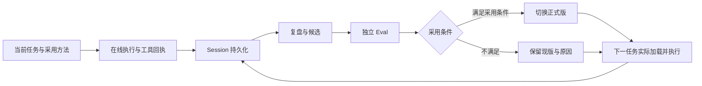

# 第 10 章：从一次执行到下一次改进

上一节：[隔离与审批](../examples/09-isolation-approval/README.md) · 下一节：[后台复盘](../examples/11-background-review/README.md)

本章是机制桥接，没有独立的 `examples/10-*` 程序。阅读完前九章后，先把在线执行与经验更新的接口理清，再进入 Hermes 原生 Memory / Skill 实验。

## 1. 学习需要越过哪些边界

一次调查得到正确报告，首先完成的是当前任务。经验要影响下次执行，还需形成可复用内容，经过验证和版本决定，再由后续任务实际加载。每轮可以采用候选，也可以依据评测保留旧版；可靠的拒绝同样是控制流程的正常出口。是否发生方法更新、是否带来业务改善，要继续检查内容差异与成对结果。

第 11–17 章拆开观察复盘、存储与文件维护；第 18–20 章增加业务评分与离线优化；第 21–23 章再把采集、共享、实例加载与回滚接起来。各章构造独立实验条件，不能把它们顺序执行就当作已经打通同一个生产流水线。

图中循环表示架构关系，当前综合练习按固定预算执行一轮。想将每条边对应到真实函数和产物，继续阅读 [自进化主线](SELF_EVOLUTION.md)：生成候选、完成决策、采用重用、测得提升和推广到新条件分别需要什么证据。

## 2. 三类持久化对象

| 对象 | 保存什么 | 不适合直接替代什么 | 后续入口 |
|---|---|---|---|
| Session | 本 Harness 记录的消息、请求和工具返回 | 外部系统的实时状态、未记录的动作 | [第 13 章](../examples/13-session-lookup/README.md) |
| Memory | 有来源与适用条件的事实、偏好 | 完整执行历史和复杂操作方法 | [第 12 章](../examples/12-memory-revision/README.md) |
| Skill | 适用场景、步骤、约束与支持资料 | 每次事故的固定答案、工具权限 | [第 15 章](../examples/15-skill-autocreation/README.md) |

支付接口旧事故里的缓存地址可以是 Memory；“按商户和订单定位、区分受理与最终到账、核对差额”是 Skill；实际查到哪些流水由 Session 和业务日志保存。三者共同支撑复盘，但真实性与新鲜度仍需回到来源检查。

## 3. 一个贯穿后半程的案例

订单应付 10000 分，成功到账 2000 分，另 8000 分仍处理中。原方法把“有一笔成功交易”当作“整单付清”，用户纠正后应累计有效成功金额，并保留待决项。

这段经历先用于选择新建或修订 Skill；生成后还要在单笔足额、分次付款、跨商户同号与结果缺失等不同条件下验证。若训练题正确但独立题退步，候选不能发布。通过小样本只支持当前协议下的结果，仍不证明生产收益或长期稳定。

## 4. 自动化不是免去工程控制

后台复盘可以异步运行，但需要队列、超时、失败状态和重试边界。写入候选不应直接替换在线版本；每次更新绑定来源、版本、数据集、评分器和采用决定。发布后核对每个实例实际加载的哈希，下载成功不等于使用成功。

回滚也要明确对象：Skill 文件回滚不自动撤销外部支付操作；Session 数据库恢复不代表远端业务状态恢复。受控变更从 [Assembly 生命周期](../examples/assembly/README.md) 与 [快照补充实验](../examples/19-snapshot-restore/README.md) 继续阅读。

## 5. 阅读后续代码时的四个问题

每章都先问：输入来自真实观测还是构造材料？哪些组件真实运行？采用决定由什么独立证据支持？输出能够证明哪一层成功？这四个问题能避免把“模型说已完成”“文件已写入”“评测通过”“新实例已加载”混成一个状态。
