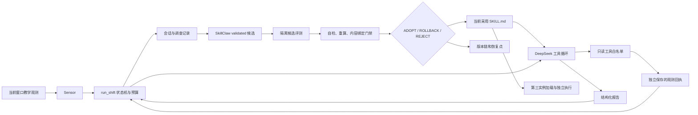

# 架构、数据流与工程边界

## 先选择接线方式

这个仓库是多组机制实验的集合。理解工程实现时，先区分执行器、教学数据和验证证据。

| 路线 | 实现入口 | 工程用途 | 边界 |
|---|---|---|---|
| 01–09 | Notebook + `examples/notebook_support.py` | 上下文、控制、分支、工具回执、审批机制 | 真实任务需要模型；离线验证只编译单元格和测试适配契约 |
| 11–16 | 各讲 Python 脚本 | Hermes 原生复盘、Memory、Session 与 Skill 学习 | 依赖 `.deps/hermes-agent`；独立练习不等于统一运行服务 |
| 17–20 | Curator、业务 Eval、企业题库、GEPA | 生命周期、评测隔离、离线优化 | 19 讲 OS 隔离采用 macOS sandbox-exec；小样本不能证明生产非劣效 |
| 21–22 | Session 收集、SkillClaw 共享修订 | 经验聚合、候选验证和分发 | 上游源码接口需要版本核验；成功发布不等于后续业务成功 |
| 23 | `final_assembly.py` → `shift/runtime.py` | 可追踪的值守、评测门禁、版本记录与恢复 | 自建 DeepSeek 工具循环，读取教学快照；未启动完整 Hermes 前台 |
| assembly | `assembly/runtime`、`lifecycle`、`eval`、`skillclaw` | 使用 Hermes 的模块化总装参考 | 单独验证每个组件与集成路径；部分真实实验依赖平台沙箱 |
| capstone | 综合实践编排 + `payment_grader.py` | 支付语义与特定队列条件的应用验收 | 只读付款调查；示例答案不能直接代替支付系统授权 |

全课程索引见 [COURSE_MAP](../COURSE_MAP.md)。模块化业务总装见 [assembly](../examples/assembly/)；值守参考见 [23 讲](../examples/23-final-assembly/)。

方法更新的因果关系见 [自进化主线](SELF_EVOLUTION.md)。本架构在固定模型和执行协议下维护 Skill 内容；候选生成、策略决定、正式目录切换与后续使用各有记录。基础 Assembly 的不劣采用条件和 Capstone 额外要求的严格增益，应按实际入口分别解释。

## 值守链路

设计上将观察、建议和状态转换分开：工具提供当时可取得的事实，模型据此提出报告，控制器检查对象、时刻、预算与必要证据。模型生成的结论不能自行授权后续状态；否则一次错误归因会同时污染执行、复盘和下一版方法。

执行协议固定以后，版本比较才有明确对象。模型、工具、输入或评分器一起改变时，分数差无法单独归因于 Skill。源码指纹保护运行条件，内容哈希绑定方法与答案，原始工具回执说明实际执行；三类证据解决不同问题，不能互相替代。



模型只能请求当前逻辑时刻、当前服务的查询。未来快照和评分标准不进入执行提示。状态转换由 Harness 核对：`PATROLLING → INVESTIGATING → VERIFYING → PATROLLING`；服务恢复要求连续新鲜窗口达到十分钟、实际读取指标并正常完成报告。未决问题保留，不随服务恢复消失。

`investigation_budget` 约束处于调查/验证阶段的实际只读工具请求，包括参数错误的请求；超限请求在读取前拒绝。它与模型循环自身的工具数、迭代数限制是不同资源约束，不代表费用上限。时钟必须严格递增，续班必须接收完整调查记录。存档上下文和工具回执使用独立副本，后续轮次不能改写“当时已经看到什么”。

## 评测与采用

23 讲六题分为新事故、保留与回归三组。`eval/runner.py` 记录技能全文和用例集的 SHA-256；`versioning/policy.py` 检查每轮技能哈希、实际加载内容、全部用例编号、原始裁判输出和确定性重算结果。源码冻结重新枚举执行源码及配置，新增文件也会阻止采用。旧指纹格式缺少枚举范围，不能继续作为采用依据。

| 决策 | 条件 | 结果 |
|---|---|---|
| REJECT | 自检失败、评分无法解析、缺题、证据损坏或版本绑定不一致 | 保留当前版，保存原因，不自动采用 |
| ROLLBACK | 完整有效评测未满足本讲三项采用标准，或没有候选 | 放弃候选，保留基线；本讲语义与采用后生产回退不同 |
| ADOPT | 保留集不退化、新事故集严格提升、回归集全过，且证据门禁通过 | 进入正常加载目录并发布采用版 |

assembly 使用另一套业务契约：`CandidateBundle / EvalReport / AdoptionDecision`。它独立重算付款语义，核对模型、数据、提示、运行编号、评分器和留出条件；采用后退化的恢复使用 `RESTORE`。不要把两套策略的决策名称互换。

哈希可以发现内容不一致，不能证明文件来自真实模型、不能替代可信运行器或签名。单元测试中的合成报告只用于验证策略分支。用户生成的真实报告必须保留请求、工具回执、运行条件和独立原始证据。

## 候选与恢复

assembly 创建候选时复制正式技能整目录，支持精确 patch、全文替换和支持文件操作；越界、符号链接、歧义 patch 与名称不匹配会拒绝。失败副本及诊断会保留，但不返回可调度的 `CandidateBundle`。采用目录在候选评测中保持原内容。

23 讲的新快照格式：

```text
snapshots/<version>/
  manifest.json          # 版本与两个文件的完整 SHA-256
  state_snapshot.json    # SessionDB 导出的会话和消息
  SKILL.md               # 同一恢复点的技能
```

先在临时目录写完文件再发布，同标签不覆盖。恢复时先核验全部文件、在隔离 SessionDB 导入、核对会话编号/消息数量/消息内容、检查 SQLite 完整性，最后通过 SQLite backup 恢复目标库。旧格式没有完整清单，需要重新生成；不可手工补哈希后当作已验证恢复点。

这是**会话历史时间点恢复演练**，会移除恢复点之后的会话，并替换目标库中的其他运行状态。SessionDB export/import 不是整套 Agent 状态备份；上游导出还有会话数量限制。生产中回退 Skill 应保留业务流水，优先采用 assembly 的技能整目录快照。恢复前停止写入并关闭相关 SessionDB。文件快照与数据库之间没有跨资源事务。

assembly 整目录恢复先验证快照与暂存副本，再替换目录；切换失败还原原目录。两个重命名之间仍存在进程崩溃窗口，可从 `.restore-backup-*` 恢复。版本 JSON 记录使用 POSIX 文件锁与原子替换，回退链指向前一次实际保留内容，完整哈希用于核对，十二位哈希仅供展示。

## 已有边界与生产接入任务

| 边界 | 当前实现 | 生产接入必须补齐 |
|---|---|---|
| 作业取消 | POSIX 独立进程组，超时先 TERM 后 KILL；保留部分输出 | 容器/cgroup 管理逃逸进程，磁盘/内存配额、全局预算与调度取消 |
| 数据隔离 | 19 讲真实 macOS 沙箱；23 讲逻辑只读工具 | Linux 沙箱独立实现与探针，租户/业务权限、网络出口约束 |
| 发布 | 本机 SkillHub 后端；本地内容更新与远端 push 分开 | 不可变版本、条件写入、发布锁、失败补偿、跨主机验证 |
| 运行环境 | 开发检查依赖锁定；四个上游源码由 deps.lock.json 固定完整提交，运行依赖按上游声明解析 | 另存实际安装依赖锁与 OS/解释器清单，核验固定源码和安装版本的兼容性 |
| 后台 | 部分原生异步练习；23 讲演化同步等待 | 队列、去重、幂等、重试与死信、租约和作业恢复 |
| 证据 | 运行编号、内容哈希、原始结果和评分自检 | 访问控制、审计留存、可信发布主体、数据版本及独立重复实验 |

以上任务未由本轮离线检查验收。接入真实业务时，从一项只读任务及影子流量开始，逐步完成 [运行手册](RUNBOOK.md) 的验收门槛。

参考实现依据：[SQLite Backup API](https://www.sqlite.org/backup.html)、[Python subprocess](https://docs.python.org/3.12/library/subprocess.html)、[Hermes 会话导入导出](https://github.com/NousResearch/hermes-agent/blob/aaf9688/hermes_state_portability.py)。

## 面试讲述与追问

我的架构判断是让模型提出行动与方法，让控制器核对事实、预算和版本。候选先隔离，评分与实际加载分别绑定内容；相比模型直接写在线规则，这样有明确的拒绝与恢复出口。接入时先选择原生支付或自建巡检路线，二者不能混称。跨主机发布、租户授权和分布式事务仍是部署工作，离线通过不补足这些能力。

**追问：为什么不用更复杂的多 Agent 系统？** 当前首先要解决的是证据归属与受控更新，多加实例可能放大状态和权限问题。先把一项只读任务的基线、候选、评分与加载打通，再依据独立并发需求增加组件。

讲述时可打开 [runtime.py](../examples/23-final-assembly/shift/runtime.py)、[contracts.py](../examples/assembly/assembly/contracts.py) 核对实现或原始记录；个人贡献与结果的表述规则见 [项目面试指南](INTERVIEW_GUIDE.md)。
